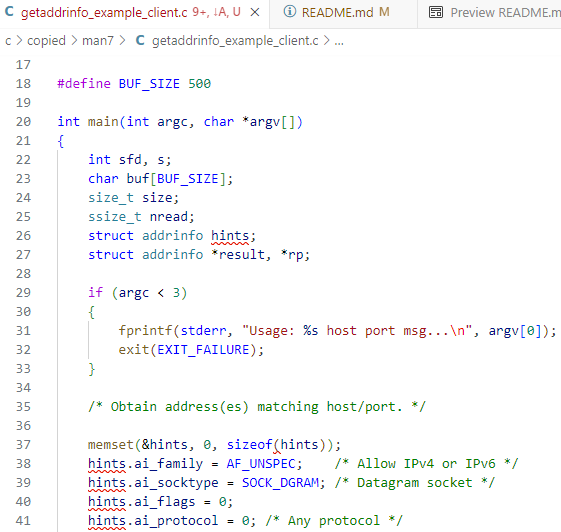
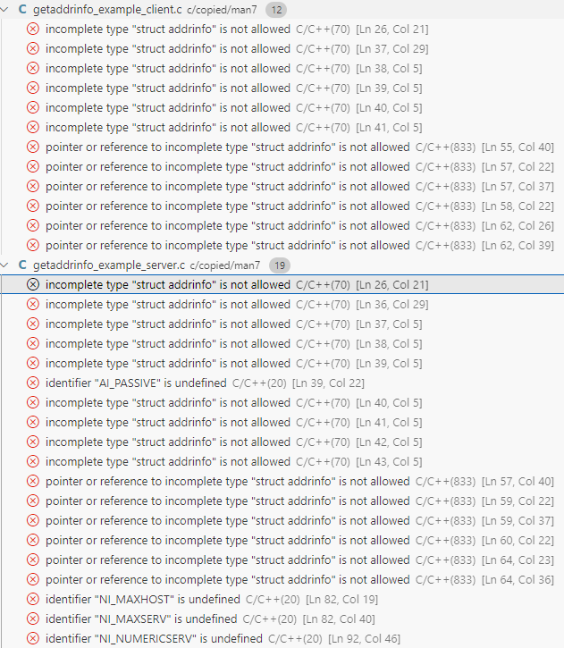

# C/C++ Sandbox
A repository which includes code written in C and code written in C++.

## Contents
**Note: this section is subject to change.**
* *This README's directory* -- The home for this README, for `.gitignore`, etc.
    * *The [`.github`](.github/) directory*
        * *The [`.github/workflows`](.github/workflows/) directory* -- This directory's files are used for continuous integration.
    * *The [`c`](c/) directory*
        * *The [`c/copied`](c/copied/) directory*
            * *The [`c/copied/gnu/`](c/copied/gnu/) directory*
            * *The [`c/copied/man7/`](c/copied/man7/) directory* -- Each `.c` or `.h` file in this directory has been copied from the webpage whose URL is in at or near the top of that file.
        * *The [`c/normal`](c/normal/) directory*
    * *The [`cpp`](cpp/) directory*
        * *The [`cpp/gen`](cpp/gen/) directory*
            * *The [`cpp/gen/input`](cpp/gen/input/) directory* -- This directory's files are used to generate and export other files to the `cpp/gen/output` directory.
            * *The `cpp/gen/output` directory* -- This directory's files might be needed for the successful compilation of one or more files in the `cpp/normal` directory. This directory's files are generated by `make`, so **`.gitignore` must specify that this directory should be ignored by Git.**
        * *The [`cpp/normal`](cpp/normal/) directory*
    * *The [`screenshots`](screenshots/) directory*
        * *The [`screenshots/github`](screenshots/github/) directory* -- This directory's files are images embedded in `TODO.md`.
        * *The [`screenshots/visual-studio-code`](screenshots/visual-studio-code/) directory* -- This directory's files are images embedded in this README.

## Using `make`
* To build, run `make` from this README's directory.
* To clean, run `make clean` from this README's directory.

## Warnings
* Because `all` and `clean` are used as Makefile targets, don't name any file or directory in this repo `all` or `clean`.
* Be careful about making edits to `.gitignore`, or else important files may get ignored.
* Be careful about making edits to `Makefile` files, or else important files might not get compiled correctly.
    * One example would be the omission of one or more prerequisites for a Makefile target.
* Only have one `.gitignore` file in this repo: namely, [the one in this README's directory](.gitignore).
    * [Click here for further explanation](#why-not-have-more-than-one-gitignore-file).

### Why not have more than one `.gitignore` file?
[This page on `.gitignore` files](https://www.atlassian.com/git/tutorials/saving-changes/gitignore) explains why it is preferable to have only *one* `.gitignore` file:
1. "If your repository has multiple .gitignore files, simply mentally replace 'repository root' with 'directory containing the .gitignore file' (and consider unifying them, for the sanity of your team)."
2. "However the convention, and simplest approach, is to define a single `.gitignore` file in the root."
3. "If you have complicated `.gitignore` patterns, or patterns spread over multiple `.gitignore` files, it can be difficult to track down why a particular file is being ignored."

## `_GNU_SOURCE`
Visual Studio Code used to show many red squiggly lines in the files [`getaddrinfo_example_client.c`](c/copied/man7/getaddrinfo_example_client.c) and [`getaddrinfo_example_server.c`](c/copied/man7/getaddrinfo_example_server.c).

Here are some of the red squiggly lines from [`getaddrinfo_example_client.c`](c/copied/man7/getaddrinfo_example_client.c) at the time:



At the time, Visual Studio Code reported the following problems:



After digging around my WSL2 distro (currently "Ubuntu 24.04.1 LTS" according to the command line instruction `lsb_release -a`), I have found two relevant `.h` files (`/usr/include/features.h` and `/usr/include/netdb.h`) and one relevant webpage (https://www.man7.org/linux/man-pages/man7/feature_test_macros.7.html). Thanks to the code in those `.h` files and to the information on that webpage, I have decided to prepend the following code block to [`getaddrinfo_example_client.c`](c/copied/man7/getaddrinfo_example_client.c) and [`getaddrinfo_example_server.c`](c/copied/man7/getaddrinfo_example_server.c) in order to get rid of those red squiggly lines:

```c
// /usr/include/features.h
// /usr/include/netdb.h
// https://www.man7.org/linux/man-pages/man7/feature_test_macros.7.html
#ifndef _GNU_SOURCE
#define _GNU_SOURCE
#endif // _GNU_SOURCE
```

## Special Thanks
I had some help with this README from...
* https://docs.github.com/en/get-started/writing-on-github/getting-started-with-writing-and-formatting-on-github/basic-writing-and-formatting-syntax
* https://docs.github.com/en/repositories/managing-your-repositorys-settings-and-features/customizing-your-repository/about-readmes
* https://docs.github.com/en/get-started/writing-on-github/working-with-advanced-formatting/creating-and-highlighting-code-blocks#syntax-highlighting
* https://github.com/github-linguist/linguist/blob/main/lib/linguist/languages.yml
