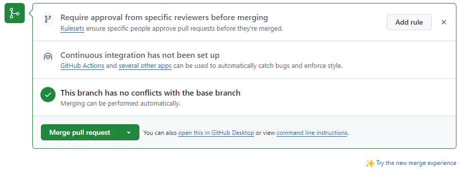
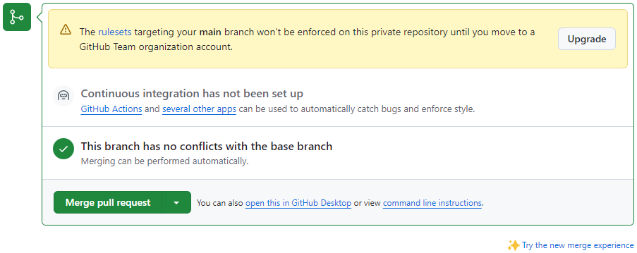
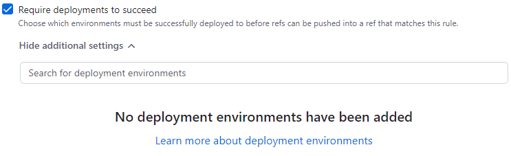
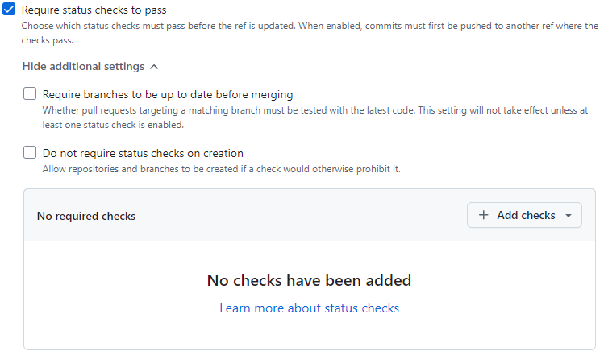

# High-priority tasks

## De-couple
* [`cpp_alias.hpp`](cpp/normal/cpp_alias.hpp)
    * `#define DECLARE_CONSTANT_ALIAS(name)` -- ***DONE: MOVE TO cpp_sockets.hpp***
* [`cpp_assert.hpp`](cpp/normal/cpp_assert.hpp)
    * `#define ASSERT_IS_CLASS(type_name)`
    * `#define ASSERT_IS_INTEGRAL(type_name)`
    * `#define ASSERT_IS_UNSIGNED(type_name)`
    * `#define ASSERT_IS_SIGNED(type_name)`
    * `#define ASSERT_MIN_SIZEOF(type_name, min_sizeof)`
    * `#define ASSERT_ACTUAL_SIZEOF(type_name, actual_sizeof)`
    * `#define ASSERT_IS_FUNCTION(func_name)`
    * `namespace testing_cpp_assert` -- ***DONE: MOVE TO NEW HPP FILE***
        * Various contents
* [`cpp_main.cpp`](cpp/normal/cpp_main.cpp) -- ***DONE: SPLIT INTO MULTIPLE FILES TESTING DIFFERENT CLASSES***
    * `#define ASSERT_IS_EMPTY_IF_AND_ONLY_IF_SIZE_IS_ZERO(t)` -- ***DONE: MOVE TO cpp_assert.hpp***
    * `#define ASSERT_SIZE_IS(t, expected_size)` -- ***DONE: MOVE TO cpp_assert.hpp***
    * `#define ASSERT_CONTAINS(t, s)` -- ***DONE: MOVE TO cpp_assert.hpp***
    * `#define ASSERT_DOES_NOT_CONTAIN(t, s)` -- ***DONE: MOVE TO cpp_assert.hpp***
    * `#define IPv4_LOOPBACK_STRING_LITERAL "127.0.0.1"` -- ***DONE: MOVE TO NEW HPP FILE***
    * `#define IPv6_LOOPBACK_STRING_LITERAL "::1"` -- ***DONE: MOVE TO NEW HPP FILE***
    * `class cpp_main`
        * `static std::string wstatus_explanation_str(int wstatus)` -- *private*
            * ***DONE: Create cpp_main::write_wstatus_explanation() -- with what arguments? -- from cpp_main::wstatus_explanation_str() and use cpp_main::write_wstatus_explanation() in cpp_main::waitpid_special()***
            * ***DONE: MOVE cpp_main::write_wstatus_explanation() TO NEW HPP FILE***
        * `static void std_cout_Trie_class(const Trie &trie)` -- *private* -- ***DONE: MOVE TO NEW HPP FILE***
        * `static void assert_equality(const Trie &trie, const std::set<std::string> &string_set)` -- *private* -- ***DONE: MOVE TO NEW HPP FILE***
        * `static void assert_emptiness(const Trie &trie, const std::set<std::string> &string_set)` -- *private* -- ***DONE: MOVE TO NEW HPP FILE***
        * `static void assert_after_inserting(Trie &trie, std::set<std::string> &string_set, const std::string &what_to_insert, const int expected_size_after_inserting)` -- *private* -- ***DONE: MOVE TO NEW HPP FILE***
        * `static void assert_after_erasing(Trie &trie, std::set<std::string> &string_set, const std::string &what_to_insert, const int expected_size_after_erasing)` -- *private* -- ***DONE: MOVE TO NEW HPP FILE***
        * `static void assert_presence(const Trie &trie, const std::set<std::string> &string_set, const std::string &what_to_search_for, const int expected_size)` -- *private* -- ***DONE: MOVE TO NEW HPP FILE***
        * `static void assert_absence(const Trie &trie, const std::set<std::string> &string_set, const std::string &what_to_search_for, const int expected_size)` -- *private* -- ***DONE: MOVE TO NEW HPP FILE***
        * `static void assert_after_clearing(Trie &trie, std::set<std::string> &string_set)` -- *private* -- ***DONE: MOVE TO NEW HPP FILE***
        * `static void test_Trie_iterators(Trie &trie)` -- *private* -- ***DONE: MOVE TO NEW HPP FILE***
        * `static void test_Trie_class()` -- *private* -- ***DONE: MOVE TO NEW HPP FILE***
        * `static void assert_string_equality(const char *s1, const char *s2)` -- *private* -- ***DONE: MOVE TO NEW HPP FILE***
        * `static void test_args_iterators(args &a, int argc, char const *argv[])` -- *private* -- ***DONE: MOVE TO NEW HPP FILE***
        * `static void test_args_class(int argc, char const *argv[])` -- *private* -- ***DONE: MOVE TO NEW HPP FILE***
        * `static void test_cpp_sockets()` -- *private* -- ***DONE: MOVE TO NEW HPP FILE***
        * `static int waitpid_special(pid_t pid)` -- *private* -- ***DONE: MOVE TO NEW HPP FILE***
        * `static int man7_client_main_fork(int argc, const char *argv[])` -- *private* -- ***DONE: MOVE TO NEW HPP FILE***
        * `static int man7_client_main_fork_call_1()` -- *private* -- ***DONE: MOVE TO NEW HPP FILE***
        * `static int man7_client_main_fork_call_2()` -- *private* -- ***DONE: MOVE TO NEW HPP FILE***
        * `static int man7_client_main_fork_call_3()` -- *private* -- ***DONE: MOVE TO NEW HPP FILE***
        * `static void test_man7()` -- *private* -- ***DONE: MOVE TO NEW HPP FILE***
        * `static void test_CHAR_TO_STRING_LITERAL()` -- *private* -- ***DONE: MOVE TO NEW HPP FILE***
        * `static void test_apportionment_class()` -- *private* -- ***DONE: MOVE TO NEW HPP FILE***
        * `static void test_cpp_protoent()` -- *private* -- ***DONE: MOVE TO NEW HPP FILE***
        * `static void test_man7_inet_pton_example()` -- *private* -- ***DONE: MOVE TO NEW HPP FILE***
        * `static void test_man7_sendmmsg_example()` -- *private* -- ***DONE: MOVE TO NEW HPP FILE***
        * `static int man7_getaddrinfo_example_client_main_fork(int argc, const char *argv[])` -- *private* -- ***DONE: MOVE TO NEW HPP FILE***
        * `static void test_man7_getaddrinfo_example(const char *host)` -- *private* -- ***DONE: MOVE TO NEW HPP FILE***
        * `static void test_man7_select_tut_example(const char *host)` -- *private* -- ***DONE: MOVE TO NEW HPP FILE***
        * `static int main_function(int argc, char const *argv[])` -- *public* -- ***DONE: SPLIT***
    * `int main()`
* [`man7_client.hpp`](cpp/normal/man7_client.hpp)
    * `class man7_client`
        * `static std::string client_buffer_str(const std::string &buffer)` -- *private* -- ***DONE: Inline into man7_client::write_client_buffer()***
        * `static std::string argv_str(int argc, const char *argv[], int i)` -- *private* -- ***DONE: Replace `man7_connection::write_function_results(__func__, argv_str(argc, argv, i), w, errnum)` with `man7_client::write_argv_str(__func__, argc, argv, i, w, errnum)` and inline argv_str() into the latter***
        * `static void write_client_buffer(const std::string &buffer)` -- *private*
        * `static int man7_client_main(int argc, const char *argv[], int num_tries_left = 5)` -- *public*
* [`man7_connection.hpp`](cpp/normal/man7_connection.hpp)
    * `class man7_connection`
        * `static std::string function_results_str(const std::string &name_of_calling_function, const std::string &string_containing_name_of_function_called, int return_value, int errnum)` -- *private* -- ***DONE: Inline into man7_connection::write_function_results()***
        * `static std::string num_tries_left_str(const std::string &str, int num_tries_left)` -- *private* -- ***DONE: Inline into man7_connection::write_num_tries_left()***
        * `static void write_str(const std::string &str)` -- *public*
        * `static void write_function_results(const std::string &name_of_calling_function, const std::string &string_containing_name_of_function_called, int return_value, int errnum)` -- *public*
        * `static void close_without_changing_errno(const std::string &name_of_calling_function, int fd)` -- *public*
        * `static void write_num_tries_left(const std::string &str, int num_tries_left)` -- *public*
        * `static void write_loop_variable(int i)` -- *public*
* [`man7_getaddrinfo_example_client.hpp`](cpp/normal/man7_getaddrinfo_example_client.hpp)
    * `#define _GNU_SOURCE` -- *within `#ifndef` block* -- ***DONE: MOVE TO NEW HPP FILE***
    * `#define BUF_SIZE_getaddrinfo 500` -- *within `#ifndef` block* -- ***DONE: MOVE TO NEW HPP FILE***
    * `class man7_getaddrinfo_example_client`
        * `static int man7_getaddrinfo_example_client_main(int argc, char const *argv[])` -- *public*
        * `static void write_ignoring_long_message(int index)` -- *private*
        * `static void write_num_bytes_received(ssize_t nread, const std::string &buf)` -- *private*
        * `static void write_usage(const std::string &argv_0)` -- *private*
        * `static void write_getinfo_results(const std::string &name_of_calling_function, const std::string &name_of_function_called, int return_value, int errnum)` -- *public* -- ***DONE: MOVE POST-INLINING VERSION TO NEW HPP FILE***
        * `static std::string getinfo_results_str(const std::string &name_of_function_called, int getaddrinfo_return_value)` -- *private* -- ***DONE: Inline into man7_getaddrinfo_example_client::write_getinfo_results()***
* [`man7_getaddrinfo_example_server.hpp`](cpp/normal/man7_getaddrinfo_example_server.hpp)
    * `#define _GNU_SOURCE` -- *within `#ifndef` block* -- ***DONE: MOVE TO NEW HPP FILE***
    * `#define BUF_SIZE_getaddrinfo 500` -- *within `#ifndef` block* -- ***DONE: MOVE TO NEW HPP FILE***
    * `class man7_getaddrinfo_example_server`
        * `static const int MAX_NUM_TRIES = 4` -- *private*
        * `static int man7_getaddrinfo_example_server_main(int argc, char const *argv[])` -- *public*
        * `static void write_num_bytes_received(ssize_t nread, const std::string &host, const std::string &service)` -- *private*
        * `static void write_usage(const std::string &argv_0)` -- *private*
* [`man7_inet_pton_example.hpp`](cpp/normal/man7_inet_pton_example.hpp)
    * `class man7_inet_pton_example`
        * `static int man7_inet_pton_example_main(int domain, const std::string &addr_str)` -- *public*
        * `static std::string inet_ntop_results_str(const std::string &name_of_calling_function, const std::string &addr_str, bool failure, int errnum)` -- *private* -- ***DONE: Inline into man7_inet_pton_example::write_inet_ntop_results()***
        * `static void write_inet_ntop_results(const std::string &name_of_calling_function, const std::string &addr_str, bool failure, int errnum)` -- *private*
        * `static std::string inet_pton_str(const std::string &addr_str, int result)` -- *private* -- ***DONE: Inline into man7_inet_pton_example::write_inet_pton_results()***
        * `static void write_inet_pton_results(const std::string &name_of_calling_function, const std::string &addr_str, int result, int errnum)` -- *private*
        * `static std::string as_hex(uint8_t i)` -- *private*
        * `static void write_in_addr(const in_addr &addr)` -- *private*
        * `static void write_in6_addr(const in6_addr &addr)` -- *private*
        * `static void check_str_equality(const std::string &addr_str, const std::string &addr_str_2)` -- *private*
        * `static void change_errnum_if_inet_pton_returns_zero(int result, int &errnum)` -- *private*
        * `static int man7_inet_pton_example_ipv4(const std::string &addr_str)` -- *private*
        * `static int man7_inet_pton_example_ipv6(const std::string &addr_str)` -- *private*
* [`man7_select_tut_example.hpp`](cpp/normal/man7_select_tut_example.hpp)
    * `#define BUF_SIZE_select_tut 1024` -- ***DONE: Place within `#ifndef` block***
    * `class man7_select_tut_example`
        * `static const int MAX_NUM_LOOPS = 10` -- *private*
        * `static const int SELECT_TIMEOUT_IN_SECONDS = 2` -- *private*
        * `int forward_port = 0` -- *private*
        * `static int maximum_of_two_ints(int x, int y)` -- *private*
        * `static void shut_fd_without_changing_errno(const std::string &name_of_calling_function, int &fd)` -- *private*
        * `static int listen_socket(int listen_port_in_host_byte_order)` -- *private*
        * `static int connect_socket(int connect_port_in_host_byte_order, const char *address)` -- *private*
        * `static void write_inet_aton_results(const std::string &name_of_calling_function, const std::string &addr_str, bool failure, int errnum)` -- *private*
        * `static std::string inet_aton_results_str(const std::string &name_of_calling_function, const std::string &addr_str, bool failure, int errnum)` -- *private* -- ***DONE: Inline into man7_select_tut_example::write_inet_aton_results()***
        * `static int change_sigaction(int signum, struct sigaction &oldact)` -- *private*
        * `static void revert_sigaction(const std::string &name_of_calling_function, int signum, const struct sigaction &oldact)` -- *private* -- ***DONE: Create man7_select_tut_example::write_sigaction_function_results() -- with what arguments? -- from man7_select_tut_example::revert_sigaction() and use man7_select_tut_example::write_sigaction_function_results() in man7_select_tut_example::change_sigaction()***
        * `int man7_select_tut_example_main(int argc, char const *argv[])` -- *public*
        * `static void write_connect_from(const sockaddr_in &addr)` -- *private*
        * `static void write_accepting_connections(int listen_port_in_host_byte_order)` -- *private*
        * `static std::string fd_str(const std::string &string_containing_name_of_function_called, int fd)` -- *private* -- ***DONE: Create man7_select_tut_example::write_function_results_with_fd_str() -- with what arguments? -- from man7_select_tut_example::fd_str() and man7_select_tut_example::write_function_results_with_fd_str() in man7_select_tut_example::man7_select_tut_example_main()***
* [`man7_sendmmsg_example.hpp`](cpp/normal/man7_sendmmsg_example.hpp)
    * `class man7_sendmmsg_example`
        * `static int man7_sendmmsg_example_main(void)` -- *public*
        * `static std::string sendmmsg_results_str(int return_value)` -- *private* -- ***DONE: Inline into man7_sendmmsg_example::write_sendmmsg_results()***
        * `static void write_sendmmsg_results(const std::string &name_of_calling_function, int return_value, int errnum)` -- *private*
        * `static std::string void_pointer_str(const void *pointer)` -- *private* -- ***DONE: Remove `errno` from this function***
        * `static std::string iovec_str(const iovec &iov, bool display_as_chars)` -- *private* -- ***DONE: Inline into man7_sendmmsg_example::msghdr_str()***
        * `static std::string msghdr_str(const msghdr &msg_hdr)` -- *private* -- ***DONE: Inline into man7_sendmmsg_example::mmsghdr_str()***
        * `static std::string mmsghdr_str(const mmsghdr &message)` -- *private* -- ***DONE: Inline into man7_sendmmsg_example::mmsghdrs_str()***
        * `static std::string mmsghdrs_str(const mmsghdr *messages, int num_messages)` -- *private* -- ***DONE: Inline into man7_sendmmsg_example::write_mmsghdrs()***
        * `static void write_mmsghdrs(const mmsghdr *messages, int num_messages)` -- *private*

## Add IPv4 and IPv6 info
- [x] Add stuff related to IPv4
- [ ] Add stuff related to IPv6

## Moving code
- [x] Moved all code in `c/normal/c_headers.*` to `c/normal/c_main.c`. Also deleted `c/normal/c_headers.*` and edited `c/normal/Makefile` to compensate.
- [x] Moved all code in `cpp/normal/cpp_args.cpp` to `cpp/normal/cpp_args.hpp`. Also deleted `cpp/normal/cpp_args.cpp` and `cpp/normal/cpp_trie.cpp` and edited `cpp/normal/Makefile` to compensate.

## Test or re-test everything
- [x] Ensure the correctness of *each and every* function in this repo.

It might be a good idea to separate the following subtasks by file type, and handle the file types in this order:
- [x] 1. Ensure the correctness of *each and every* `Makefile` in this repo.
- [x] 2. Ensure the correctness of *each and every* function in *each and every* `.c` in this repo.
- [x] 3. Ensure the correctness of *each and every* function in *each and every* `.h` in this repo.
- [x] 4. Ensure the correctness of *each and every* function in *each and every* `.cpp` in this repo, especially the correctness of all concurrent code.
- [x] 5. Ensure the correctness of *each and every* function in *each and every* `.hpp` in this repo, especially the correctness of all concurrent code.

## Merge approval policy AND continuous integration

2 tasks complete: Merge approval, CI

### Task list
The following two tasks are listed in the screenshot below:
- [x] Create a merge approval policy -- *[Taken care of already, it seems](#the-first-task-seems-to-have-been-taken-of-already-due-to-the-completion-of-another-task)*
- [x] Create a GitHub Action ~~(or something similar to it)~~ for continuous integration -- *I'm not sure there is anything "similar to it."*

### Screenshots

#### Both tasks

#### The "merge approval policy" task seems to have been taken of already due to the completion of [another task](#protecting-the-main-branch).

#### "Suggested workflows" for this repo

## Protecting the `main` branch

Task complete: Create a branch protection policy

### Task list
The following task is listed in the screenshot below:
- [x] Create a branch protection policy

### Screenshot

.

.

.

.

.

# Medium-priority tasks

## Add steps to [workflow file(s)](.github/workflows/)
- [ ] Make sure that [this new YML file](.github/workflows/c-cpp.yml) has steps that run this repo's executable files after running `make` and before running `make clean`

.

.

.

.

.

# Low-priority tasks

## Add "verbose" flag (`-v`) to Makefiles
- [ ] Add the `-v` option to each use of `rm` in each Makefile in this repo

## New "deployment environments"

### Task list
The following task is listed in the screenshot below:
- [ ] Create one or more new "deployment environments," each for use with one or more rulesets

### Screenshot

## New "status checks"

### Task list
The following task is listed in the screenshot below:
- [ ] Create one or more new "status checks," each for use with one or more rulesets

### Screenshot

.

.

.

.

.

# Special Thanks
I had some help with this TODO file from...
* https://docs.github.com/en/get-started/writing-on-github/getting-started-with-writing-and-formatting-on-github/basic-writing-and-formatting-syntax
* https://docs.github.com/en/get-started/writing-on-github/working-with-advanced-formatting/about-task-lists
* https://docs.github.com/en/get-started/writing-on-github/working-with-advanced-formatting/organizing-information-with-collapsed-sections
* https://docs.github.com/en/pull-requests/collaborating-with-pull-requests/addressing-merge-conflicts/resolving-a-merge-conflict-on-github
* https://docs.github.com/en/get-started/learning-about-github/github-glossary#base-branch
* https://docs.github.com/en/get-started/learning-about-github/github-glossary#head-branch
